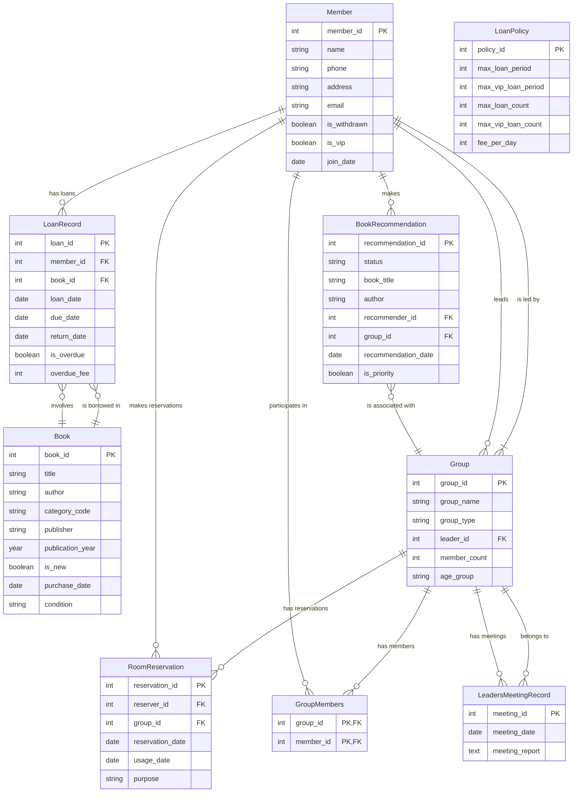

# Library Mangement System

Library Mangement System Project using Tkinter and MySQL

# Structured Query Language

Devcontainer에 접속한다.

```bash
vscode ➜ /workspaces/sql (main) $ chmod +x connect_mysql.sh
vscode ➜ /workspaces/sql (main) $ ./connect_mysql.sh
Enter password: 
Welcome to the MySQL monitor.  Commands end with ; or \g.
Your MySQL connection id is 8
Server version: 9.1.0 MySQL Community Server - GPL

Copyright (c) 2000, 2018, Oracle and/or its affiliates. All rights reserved.

Oracle is a registered trademark of Oracle Corporation and/or its
affiliates. Other names may be trademarks of their respective
owners.

Type 'help;' or '\h' for help. Type '\c' to clear the current input statement.

mysql> 
```

```bash
USE [database_name];

SOURCE sales_orders_database.sql
```

## Financial Statement Database

Transaction Table

|id|date|amount|type|category|description|payment_method|created_at|update_at|
|---|---|---|---|---|---|---|---|---|

Impossible1379!

# Path

```bash
export PYTHONPATH="/Users/kevinliam/Desktop/anthony/development/library-management-system"
```

# ERD

